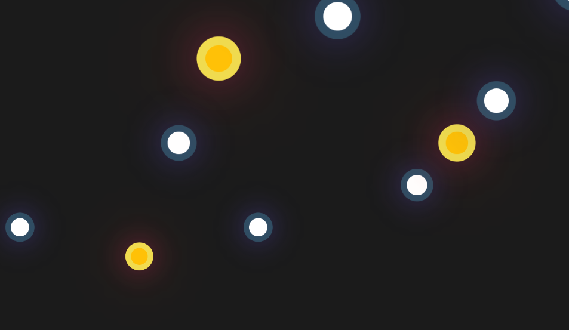

# Particles

This project is about a Particles is made with HTML, CSS and Sass and I use the method keyframes

# Screen Project



# Install

```sh
git clone https://github.com/asalinasf/particles/
cd particles
open in your browse
```
# Visit my project with this url

https://keyframesaaronsalinas.netlify.app/
